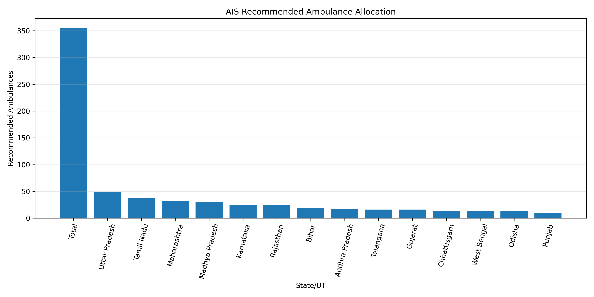

# 🚑 Smart Road Accident Risk Prediction and Resource Allocation System using Artificial Immune System (AIS)


## 📌 Project Overview

Road accidents remain one of the leading causes of fatalities worldwide, placing enormous pressure on emergency response systems and government infrastructure. Efficient allocation of ambulances, highway patrol units, and trauma centers is critical to reducing response time and saving lives.

This project presents an **AI-powered Smart Road Accident Risk Prediction and Resource Allocation System** that predicts accident fatalities, classifies road safety risk levels, and recommends optimal emergency resource allocation using **Artificial Immune System (AIS)** optimization.

The system combines traditional Machine Learning, Deep Learning, and Bio-inspired Optimization to improve prediction accuracy while providing actionable insights for government agencies and transport authorities.

---

# 🎯 Objectives

- Predict road accident fatalities for each State/UT.
- Classify road accident risk into Low, Medium, and High categories.
- Optimize prediction performance using Artificial Immune System (AIS).
- Recommend ambulance allocation.
- Recommend highway patrol deployment.
- Recommend trauma center allocation.
- Generate comprehensive visual analytics.
- Export trained models and prediction results.

---

# 🏛 Problem Statement

Government agencies require an intelligent system capable of:

- Identifying high-risk states.
- Forecasting future accident fatalities.
- Allocating emergency resources efficiently.
- Reducing response time.
- Supporting data-driven policy decisions.

This project addresses these challenges using Artificial Intelligence and Artificial Immune System optimization.

---

# 📂 Dataset

**Dataset**

```
Transport_2024_Annexure_3.csv
```

The dataset contains state-wise road accident statistics including:

- Total fatalities (2021–2024)
- Population-based fatality rates
- Vehicle-based fatality rates
- Road density fatality rates
- National fatality share
- State rankings

---




# 🛠 Technologies Used

- Python
- Pandas
- NumPy
- Scikit-Learn
- TensorFlow / Keras
- Matplotlib
- Artificial Immune System (AIS)
- YAML
- JSON
- Pickle

---

# 🧠 Machine Learning Workflow

```
Dataset
      │
      ▼
Data Cleaning
      │
      ▼
Feature Engineering
      │
      ▼
Train-Test Split
      │
      ▼
Feature Scaling
      │
      ▼
Random Forest
      │
      ▼
Artificial Neural Network
      │
      ▼
AIS Optimization
      │
      ▼
Prediction
      │
      ▼
Risk Classification
      │
      ▼
Resource Allocation
      │
      ▼
Visualization
```

---

# ⚙ Feature Engineering

The following engineered features are created:

- Fatality Growth (2021–2024)
- Fatality Growth (2023–2024)
- Road Safety Risk Index
- Recommended Ambulances
- Recommended Highway Patrol Units
- Recommended Trauma Centers

---

# 🚑 Risk Classification

The Road Safety Risk Index categorizes states into:

- 🟢 Low Risk
- 🟡 Medium Risk
- 🔴 High Risk

---

# 🧬 Artificial Immune System Optimization

Artificial Immune System (AIS) is inspired by the biological immune system.

AIS improves prediction quality by:

- Cloning high-performing solutions.
- Introducing adaptive mutations.
- Selecting improved solutions.
- Minimizing prediction error.
- Enhancing robustness.

Advantages include:

- Better convergence
- Reduced prediction error
- Increased model stability
- Improved regression accuracy

---

# 🤖 Machine Learning Models

## Random Forest Regressor

Predicts:

- Road accident fatalities

---

## Random Forest Classifier

Predicts:

- Risk Level
  - Low
  - Medium
  - High

---

## Artificial Neural Network (ANN)

Used for regression prediction of fatalities.

---

## Artificial Immune System (AIS)

Optimizes:

- Random Forest predictions
- ANN predictions

---

# 📊 Evaluation Metrics

Regression Metrics

- Mean Absolute Error (MAE)
- Root Mean Square Error (RMSE)
- R² Score

Classification Metrics

- Accuracy
- Precision
- Recall
- F1-Score
- Confusion Matrix

---

# 📈 Generated Outputs

The project automatically generates the following outputs.

## Models

```
ais_road_accident_ann_model.h5
ais_road_accident_ml_models.pkl
```

---

## Configuration Files

```
ais_road_accident_config.yaml
ais_road_accident_metrics.json
```

---

## CSV Files

```
ais_road_accident_result.csv

ais_road_accident_prediction.csv

ais_comparison.csv
```

---

## Graphs

### Accuracy Graph

```
ais_accuracy_graph.png
```

Shows classification accuracy.

---

### Confusion Matrix

```
ais_confusion_matrix_heatmap.png
```

Visualizes classification performance.

---

### Model Comparison

```
ais_comparison_graph.png
```

Compares Random Forest and ANN after AIS optimization.

---

### Result Graph

```
ais_result_graph.png
```

Compares:

- Actual fatalities
- Random Forest predictions
- ANN predictions

---

### Prediction Graph

```
ais_prediction_graph.png
```

Displays predicted fatalities for all states.

---

### Resource Allocation Graph

```
ais_resource_allocation_graph.png
```

Shows recommended ambulance allocation for the highest-risk states.

---

### Risk Distribution Graph

```
ais_risk_distribution_graph.png
```

Displays the predicted distribution of road accident risk levels.

---

# 🚨 Emergency Resource Recommendation

The system automatically estimates:

- Number of ambulances required
- Highway patrol deployment
- Trauma center requirements

These recommendations are based on the predicted accident fatalities and the calculated Road Safety Risk Index.

---

# 📊 Sample Prediction Output

| State | Actual Fatalities | Predicted Fatalities | Risk Level | Ambulances |
|---------|------------------|----------------------|------------|------------|
| Maharashtra | 15,000 | 15,230 | High | 31 |
| Tamil Nadu | 14,200 | 14,050 | High | 29 |
| Uttar Pradesh | 12,700 | 12,880 | High | 26 |

---

# 📁 Project Structure

```
Smart Road Accident Risk Prediction and Resource Allocation System/

│
├── Transport_2024_Annexure_3.csv
│
├── ais_road_accident_ann_model.h5
├── ais_road_accident_ml_models.pkl
├── ais_road_accident_config.yaml
├── ais_road_accident_metrics.json
│
├── ais_road_accident_result.csv
├── ais_road_accident_prediction.csv
├── ais_comparison.csv
│
├── ais_accuracy_graph.png
├── ais_confusion_matrix_heatmap.png
├── ais_comparison_graph.png
├── ais_result_graph.png
├── ais_prediction_graph.png
├── ais_resource_allocation_graph.png
├── ais_risk_distribution_graph.png
│
└── README.md
```

---

# ▶ How to Run

## Install Dependencies

```bash
pip install pandas numpy matplotlib scikit-learn tensorflow pyyaml
```

---

## Run

```bash
python smart_road_accident_prediction.py
```

All trained models, graphs, CSV files, configuration files, and evaluation metrics will be generated automatically inside the project folder.

---

# 📌 Applications

- Ministry of Road Transport
- State Traffic Police
- Smart City Projects
- Highway Safety Authorities
- Emergency Medical Services
- Disaster Response Planning
- Government Policy Analysis
- AI-based Transport Decision Support Systems

---

# 🔮 Future Enhancements

- Real-time accident prediction using IoT sensors.
- Weather-aware accident forecasting.
- Traffic congestion integration.
- GIS-based accident hotspot visualization.
- Deep Reinforcement Learning for resource allocation.
- Mobile application for emergency response.
- Integration with Google Maps APIs.
- Live dashboard using Streamlit or Flask.

---

# 📚 Conclusion

This project demonstrates how Artificial Intelligence and Artificial Immune System optimization can be combined to improve road safety planning. By forecasting accident fatalities, classifying risk levels, and recommending emergency resource allocation, the system supports proactive decision-making for transport authorities and government agencies. The generated visualizations, trained models, and prediction reports provide a comprehensive framework for building data-driven road safety strategies.

---

# 👨‍💻 Author

**Sagnik Patra**

M.Tech – Computer Science & Engineering

Artificial Intelligence • Machine Learning • Bio-inspired Optimization • Data Science
